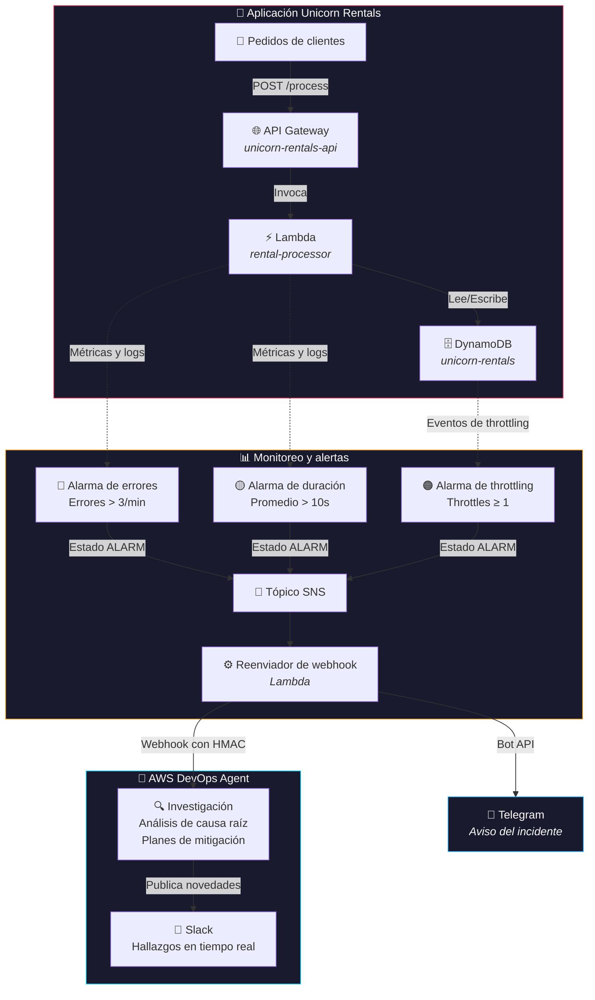

# La última guardia manual

### Cómo AWS DevOps Agents tomaron el turno de noche en nuestra plataforma

**por Roxs** · AWS Community Day Argentina 2026

Este es el entorno de demo de la charla. Levanta una plataforma de microservicios real (**Unicorn Rentals**) con fallas plantadas a propósito, y deja que **AWS DevOps Agent** haga lo que antes hacía una persona a las 3 de la mañana: leer logs, correlacionar métricas, encontrar la causa raíz y proponer una mitigación.

La idea de la demo es simple: primero mostramos la guardia manual (dashboards, logs, hipótesis a mano), y después le pasamos el turno al agente.

## La plataforma

**Unicorn Rentals** es un sistema de reservas con lógica de procesamiento de alquileres y reportes de analítica:



La arquitectura tiene puntos de falla intencionales que sirven para mostrar la capacidad de diagnóstico del agente a través de varios servicios de AWS.

## Los tres escenarios de la guardia

### 🧠 Escenario 1: Memoria agotada
**La analítica de alquileres se come la RAM**
- **Problema**: el procesador de alquileres se queda sin memoria (127 de 128 MB usados)
- **Causa**: carga datasets grandes de analítica durante el procesamiento
- **Impacto**: 30% de reservas fallidas con demoras de 10 segundos o más
- **Síntomas**: errores `Runtime.OutOfMemory`, timeouts de procesamiento

### 🗄️ Escenario 2: Throttling de base de datos
**La capacidad no da en el pico de demanda**
- **Problema**: se excede la capacidad de DynamoDB cuando sube el tráfico
- **Causa**: se toca el límite de throughput aprovisionado en operaciones por lote
- **Impacto**: demoras de 5 segundos o más en las reservas, fallas intermitentes
- **Síntomas**: errores `ProvisionedThroughputExceeded`

### 🔗 Escenario 3: Falla en cascada
**El error se propaga entre servicios**
- **Problema**: reacción en cadena que atraviesa varios servicios
- **Causa**: throttling de la base → timeouts en Lambda → errores 5XX en API Gateway
- **Impacto**: caída total del sistema, todos los clientes afectados
- **Síntomas**: fallas de dependencias a lo largo de todo el stack

## Runbook de la charla

El guion técnico del día. Cada paso tiene el detalle más abajo; esto es la secuencia y el orden. El entorno se despliega en la cuenta `459137896070`, región **us-east-1**, y los recursos quedan con prefijo **`prod-`**.

### A. Preparación (una sola vez, con tiempo antes de la charla)

- [ ] Desplegar el stack: `./deploy.sh` → ver "Puesta en marcha"
- [ ] Crear el Agent Space con filtro por tag `Application = unicorn_rentals` → ver "El agente toma el turno"
- [ ] Crear un workspace de Slack gratuito, un canal para la demo, e invitarlo al bot de DevOps Agent → ver "Integración con Slack"
- [ ] Conectar el canal de Slack al Agent Space
- [ ] Generar el webhook en el Space y redesplegar con `DEVOPS_AGENT_WEBHOOK_URL` y `DEVOPS_AGENT_WEBHOOK_SECRET`
- [ ] (Opcional) Configurar Telegram: `./telegram-check.sh` y redesplegar con `TELEGRAM_BOT_TOKEN` y `TELEGRAM_CHAT_ID`

### B. Ensayo (lo más importante y lo que todavía falta)

- [ ] Correr el ciclo completo de punta a punta al menos una vez: carga → alarma → investigación → Slack
- [ ] **Cronometrar** cuánto tarda el agente desde que se dispara la alarma hasta que aparece la causa raíz en Slack. Ese número define el guion: si tarda varios minutos, hay que saber qué se cuenta mientras tanto
- [ ] Confirmar que el mensaje de Telegram se ve bien proyectado (no solo en el celular)
- [ ] Grabar un **plan B**: video o capturas del ciclo funcionando, por si el wifi del venue falla
- [ ] Practicar `./reset-alarms.sh` entre corridas para poder repetir

> ⚠️ **Estado actual: nada de esto se desplegó ni se probó en vivo todavía.** La validación hecha es de sintaxis, estructura y lógica con mocks. Los tiempos de abajo están sin medir a propósito: se completan en el ensayo.

### C. En vivo (la secuencia sobre el escenario)

1. **Antes de subir**: dejar corriendo carga de fondo sana
   `python continuous-load-generator.py --api-url $API_URL --rps 5 --baseline`
2. **Acto 1 — la guardia manual**: mostrar dashboards y logs a mano, plantear la hipótesis "a la vieja usanza"
3. **Detonar**: subir la carga para forzar errores
   `python continuous-load-generator.py --api-url $API_URL --rps 15 --duration 10`
4. **La alarma se dispara** → el celular vibra (Telegram = el pager de la vieja guardia)
5. **Acto 2 — el turno de noche**: el agente arranca solo y el razonamiento aparece en Slack (causa raíz, plan de mitigación)

### Tiempos de referencia (completar en el ensayo)

| Tramo | Tiempo medido |
|---|---|
| Carga alta → alarma en ALARM | _por medir_ |
| Alarma → investigación arranca | _por medir_ |
| Investigación → causa raíz en Slack | _por medir_ |
| Ciclo completo | _por medir_ |

### Si falta tiempo, recortar en este orden

1. Telegram — es un lindo detalle, pero Slack es lo que muestra el valor real
2. El núcleo que **no** se toca: carga → alarma → el agente investiga → Slack

### EventBridge: mencionarlo, no construirlo

DevOps Agent emite eventos del ciclo de vida (`Investigation Created`, `Completed`, etc.) a EventBridge. Es una gran frase para la charla ("de acá los hallazgos van a donde quieras") sin el riesgo de construir un relay que nunca se probó en vivo.

## Puesta en marcha

### Requisitos previos
- AWS CLI configurado con permisos suficientes
- Python 3.7 o superior con la librería `requests`
- Permisos para desplegar con CloudFormation

### 1. Desplegar la infraestructura

```bash
# Dar permisos de ejecución al script
chmod +x deploy.sh

# Desplegar el stack completo
./deploy.sh
```

El despliegue crea:
- **API Gateway**: `prod-unicorn-rentals-api`
- **Función Lambda**: `prod-unicorn-rental-processor` (128 MB de memoria, 30% de tasa de error)
- **Tabla DynamoDB**: `prod-unicorn-rentals` (capacidad aprovisionada baja)
- **Alarmas de CloudWatch**: tasa de errores, duración y throttling

> El prefijo es `prod` porque `deploy.sh` despliega con `ENVIRONMENT="prod"`. Es a propósito: en la charla querés que la consola diga "prod" cuando se prende la alarma.

### 2. Cargar las variables de entorno

```bash
# Cargar el archivo de entorno generado
source demo-environment.env

# Verificar el despliegue
echo "URL de la API: $API_URL"
echo "Lambda: $LAMBDA_NAME"
echo "Tabla: $TABLE_NAME"
```

### 3. Generar carga realista

Instalar las dependencias de Python:
```bash
pip install requests
```

Arrancar la carga continua en segundo plano:
```bash
# Carga liviana y continua (5 RPS de base)
python continuous-load-generator.py --api-url $API_URL --rps 5 --duration 10

# Más carga, para que aparezcan errores más rápido
python continuous-load-generator.py --api-url $API_URL --rps 15 --duration 10
```

El generador de carga produce patrones de tráfico realistas, con picos en horario laboral y algún pico esporádico.

> **Tip para la charla**: arrancá con `--baseline` unos minutos antes de subir al escenario. Eso deja tráfico limpio y sano de fondo, así el momento en que las alarmas se disparan se siente como un incidente de verdad y no como un script.

## El agente toma el turno

### Preparar el Space de DevOps Agent

1. **Crear el Space**
   - Ir a la consola de AWS → DevOps Agent
   - Crear un Space nuevo para la demo
   - Incluir recursos con el tag: `Application = unicorn_rentals`
   - Con eso descubre e incluye automáticamente:
     - API Gateway: `prod-unicorn-rentals-api`
     - Función Lambda: `prod-unicorn-rental-processor`
     - Tabla DynamoDB: `prod-unicorn-rentals`
     - Alarmas y logs de CloudWatch

2. **Abrir la WebApp y arrancar la investigación**
   - Abrir la WebApp de DevOps Agent desde tu Space
   - Iniciar la investigación con los prompts de abajo
   - El agente analiza logs, métricas y relaciones entre servicios

### Prompts de investigación

Estos son los prompts para usar en vivo con AWS DevOps Agent:

#### Análisis de problemas de memoria
```
El rendimiento de mi aplicación unicorn_rentals se degradó bastante. Los tiempos de
respuesta de las reservas de clientes aumentaron y estoy viendo más errores en el
procesamiento de alquileres. ¿Podés analizar el comportamiento del sistema en la última hora?
```

#### Investigación de latencia
```
Mi procesador de alquileres de unicornios tiene picos de latencia altos durante la
confirmación de reservas. Las métricas de duración muestran que algunos procesamientos
tardan mucho más que otros. ¿Qué está causando este rendimiento inconsistente?
```

#### Análisis de causa raíz
```
Detalles de la investigación: ¿por qué mi API Gateway de unicorn rentals muestra más
latencia y errores 5XX? Las reservas de clientes funcionaban bien hace un rato.
```

### Integración con Slack

Una vez que agregaste tu Workspace de Slack como proveedor de capacidades, seguí estos pasos para completar la integración:

1. **Asociar el canal de Slack a tu Agent Space**
   - En tu Agent Space, ir a **Capabilities** → **Communications** → **Slack**
   - Elegir **Add Slack** e ingresar el Channel ID del canal destino
   - Elegir **Create** para completar la asociación
   - Si el canal es privado, invitá al bot de DevOps Agent al canal antes de que pueda publicar

2. **Cómo funciona Slack durante las investigaciones**
   - Cuando arranca una investigación (a mano desde la WebApp, por webhook o desde una integración de ticketing), DevOps Agent publica novedades automáticamente en el canal configurado
   - El canal recibe los hallazgos principales, el análisis de causa raíz y los planes de mitigación mientras la investigación avanza
   - El equipo puede seguirlo en tiempo real sin necesidad de acceso a la consola

3. **Cómo iniciar investigaciones en esta demo**
   - Las investigaciones se inician desde la WebApp de DevOps Agent (pestaña Incident Response), no directamente desde Slack
   - Usá los prompts de la sección anterior, o elegí un punto de partida preconfigurado como "Latest alarm" o "Error rate spike"
   - Una vez iniciada, todos los hallazgos van llegando a tu canal de Slack automáticamente
   - También podés disparar investigaciones vía webhooks desde PagerDuty, Grafana o sistemas de alertas propios

> **Nota**: Slack funciona como canal de notificación y colaboración. La investigación en sí se maneja desde la WebApp, las integraciones de ticketing o los webhooks. Evitá desinstalar la app de Slack durante el public preview, porque reinstalarla puede no funcionar.

### Notificaciones a Telegram (opcional)

Telegram funciona **en paralelo** con Slack, y es importante tener clara la diferencia:

| Canal | Qué recibe | Cómo |
|---|---|---|
| **Slack** | Los hallazgos del agente: causa raíz, análisis, plan de mitigación | Integración nativa de DevOps Agent |
| **Telegram** | El aviso de que se disparó la alarma y arrancó la investigación | Lambda reenviador → Bot API de Telegram |

DevOps Agent soporta Slack, ServiceNow y PagerDuty como proveedores de comunicación. Telegram no está en esa lista, así que **el agente no puede publicar sus hallazgos ahí de forma nativa**. Lo que sí conseguimos es el aviso del incidente, que para la charla es justo el momento que querés mostrar: el celular vibra, y en Slack empieza a aparecer el razonamiento del agente.

#### 1. Crear el bot

En Telegram, abrí un chat con **@BotFather**, mandá `/newbot` y seguí los pasos. Te va a dar un token con la forma `123456789:ABCdef...`.

#### 2. Conseguir el chat ID y probar

```bash
export TELEGRAM_BOT_TOKEN="123456789:ABCdef..."
./telegram-check.sh
```

El script valida el token, lista los chats que le escribieron al bot y te muestra el ID de cada uno. Telegram solo expone chats con actividad reciente, así que si no aparece nada: mandale un mensaje al bot (chat directo), agregalo al grupo y escribí algo (grupo), o agregalo como administrador y publicá algo (canal).

Con el ID en mano, corré el script otra vez para mandar un mensaje de prueba:

```bash
export TELEGRAM_CHAT_ID="-1001234567890"
./telegram-check.sh
```

#### 3. Desplegar

```bash
export TELEGRAM_BOT_TOKEN="123456789:ABCdef..."
export TELEGRAM_CHAT_ID="-1001234567890"
./deploy.sh
```

Los dos destinos son independientes. Podés desplegar solo con Telegram, solo con el webhook, o con los dos. El pipeline SNS se crea si hay al menos uno configurado, y si un destino falla el otro se envía igual.

> **Sobre el token**: viaja como parámetro `NoEcho` de CloudFormation, así que no aparece en los eventos ni en la consola, pero queda como variable de entorno del Lambda. Cualquiera con permiso de `lambda:GetFunctionConfiguration` en la cuenta puede leerlo. Para una demo está bien; si esto fuera a producción el token iría en Secrets Manager. Si el token se te filtra, revocalo con `/revoke` en @BotFather.

### Investigación automática por webhook (opcional)

Podés configurar las alarmas de CloudWatch para que disparen investigaciones de DevOps Agent solas cuando aparecen errores. El stack incluye un pipeline de integración por webhook opcional:

```
                                                    ┌→ Webhook de DevOps Agent → investigación → Slack
Alarma de CloudWatch → Tópico SNS → Lambda reenviador┤
                                                    └→ Bot de Telegram → aviso del incidente
```

Para habilitarlo:

1. **Generar un webhook en DevOps Agent**
   - En tu Agent Space, ir a **Capabilities** → **Webhook** → **Configure**
   - Hacer clic en **Generate webhook** para crear el par de claves HMAC
   - Guardá la URL y el secreto en un lugar seguro (el secreto no se vuelve a mostrar)

2. **Desplegar con los parámetros del webhook**
   ```bash
   export DEVOPS_AGENT_WEBHOOK_URL="https://event-ai.us-east-1.api.aws/webhook/generic/TU_ID"
   export DEVOPS_AGENT_WEBHOOK_SECRET="tu-secreto-hmac"
   ./deploy.sh
   ```

3. **Disparar el pipeline**
   - Correr el generador de carga para producir errores
   - Las alarmas de CloudWatch se disparan cuando se cruzan los umbrales
   - El Lambda reenviador envía pedidos firmados con HMAC al webhook de DevOps Agent
   - Arranca una investigación automáticamente y los hallazgos se publican en Slack

El reenviador solo dispara investigaciones en transiciones al estado ALARM (no en recuperaciones a OK), y cada alarma genera un ID de incidente único para evitar deduplicación.

> **Este es el momento fuerte de la charla**: nadie tocó nada. La alarma se disparó, el agente arrancó la investigación y los hallazgos aparecieron en Slack. Ahí es donde termina la última guardia manual.

## Detalle de la arquitectura

**Aplicación**: `unicorn_rentals`
- **API Gateway**: `${Environment}-unicorn-rentals-api` — API REST de cara al cliente
- **Lambda**: `${Environment}-unicorn-rental-processor` — lógica de negocio con restricciones puestas a propósito
- **DynamoDB**: `${Environment}-unicorn-rentals` — almacenamiento de alquileres con límites que generan throttling
- **CloudWatch**: monitoreo y alertas de todo el conjunto

**Restricciones intencionales:**
- Lambda: límite de 128 MB de memoria, timeout de 30 segundos
- DynamoDB: capacidad aprovisionada de 2 RCU/WCU
- Inyección de errores: 30% de tasa de falla con escenarios realistas

## Reiniciar las alarmas entre ensayos

Si ensayaste la demo y las alarmas quedaron en ALARM, volvelas a OK para que puedan dispararse de nuevo:

```bash
./reset-alarms.sh          # usa el entorno prod por defecto
./reset-alarms.sh prod     # o indicá el entorno explícitamente
```

## Limpieza

Borrar todos los recursos cuando termines:
```bash
aws cloudformation delete-stack --stack-name unicorn-rentals
```

## Recursos adicionales

- [Documentación de DevOps Agent](https://docs.aws.amazon.com/devopsagent/latest/userguide/)
- [Demo interactiva](https://aws.storylane.io/share/fstgtzmjif96)
- [Sesión de re:Invent](https://www.youtube.com/watch?v=JajBEYle67I)
- [Términos de servicio de AWS](https://aws.amazon.com/service-terms/)
- [Políticas de exclusión de servicios de IA](https://docs.aws.amazon.com/organizations/latest/userguide/orgs_manage_policies_ai-opt-out.html)

## Archivos del repo

- `cloudformation-template.yaml` — definición completa de la infraestructura
- `deploy.sh` — despliegue automatizado con manejo de errores
- `continuous-load-generator.py` — simulación de tráfico realista
- `reset-alarms.sh` — vuelve las alarmas de CloudWatch al estado OK
- `telegram-check.sh` — valida el bot de Telegram y ayuda a encontrar el chat ID

## Qué quedó en inglés, y por qué

Todo lo que se lee en pantalla está en español: este README, la salida de los scripts, los prompts de investigación, las descripciones de las alarmas y el título del incidente que llega a Slack.

Dos cosas quedaron deliberadamente en inglés:

**Los identificadores de AWS.** Nombres de recursos, tags, exports, variables de entorno y flags de los scripts. Son los nombres reales que se crean en la cuenta. Traducir `unicorn_rentals` rompería el filtro por tag del Agent Space, y renombrar las alarmas desacoplaría `reset-alarms.sh` del template.

**Los mensajes de log de la función `rental-processor`.** Estos son la señal de diagnóstico que DevOps Agent lee para hacer el análisis de causa raíz, y es el momento central de la charla. Los errores que genera AWS llegan en inglés de todas formas (`Runtime.OutOfMemory`, `ProvisionedThroughputExceeded`, `Task timed out`), así que traducir solo los nuestros dejaba los logs mezclados sin ganar nada. Los comentarios del código sí están en español.

El Lambda que reenvía los webhooks sí loguea en español: eso es plumbing del pipeline, va a su propio log group y no forma parte del corpus que el agente analiza.
