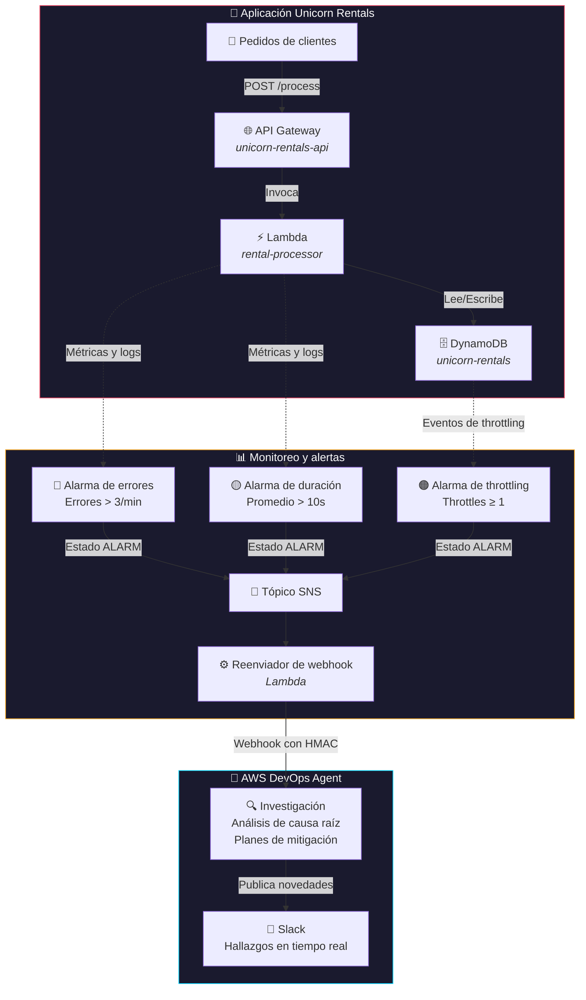

# Demo de AWS DevOps Agent

Esta demo muestra las capacidades de AWS DevOps Agent para identificar la causa raíz de problemas del sistema y acelerar la respuesta a incidentes, a través de una arquitectura de microservicios realista: **Unicorn Rentals**.

## Descripción de la aplicación

**Unicorn Rentals** es un sistema de reservas de clientes con lógica de procesamiento de alquileres y reportes de analítica:



La arquitectura incluye puntos de falla intencionales que demuestran la capacidad de diagnóstico de DevOps Agent a través de varios servicios de AWS.

## Escenarios de la demo

### 🧠 Escenario 1: Memoria agotada
**Sobrecarga de la analítica de alquileres**
- **Problema**: el procesador de alquileres se queda sin memoria (127/128 MB usados)
- **Causa**: carga de datasets grandes de analítica durante el procesamiento
- **Impacto**: 30% de reservas fallidas con demoras de 10+ segundos
- **Síntomas**: errores Runtime.OutOfMemory, timeouts de procesamiento

### 🗄️ Escenario 2: Throttling de base de datos
**Problemas de capacidad en el pico de demanda**
- **Problema**: se excede la capacidad de DynamoDB durante el tráfico alto
- **Causa**: se tocan los límites de throughput aprovisionado en operaciones por lote
- **Impacto**: demoras de 5+ segundos en las reservas, fallas intermitentes
- **Síntomas**: errores ProvisionedThroughputExceeded

### 🔗 Escenario 3: Fallas en cascada
**Propagación de errores entre servicios**
- **Problema**: reacción en cadena de errores en varios servicios
- **Causa**: throttling de base de datos → timeouts de Lambda → errores 5XX de API Gateway
- **Impacto**: caída total del sistema que afecta a todos los clientes
- **Síntomas**: fallas de dependencias a lo largo de todo el stack

## Puesta en marcha

### Requisitos previos
- AWS CLI configurado con los permisos adecuados
- Python 3.7+ con la librería `requests`
- Permisos para desplegar con CloudFormation

### 1. Desplegar la infraestructura

```bash
# Dar permisos de ejecución al script de despliegue
chmod +x deploy.sh

# Desplegar el stack completo
./deploy.sh
```

El despliegue crea:
- **API Gateway**: `demo-unicorn-rentals-api`
- **Función Lambda**: `demo-unicorn-rental-processor` (128 MB de memoria, 30% de tasa de error)
- **Tabla DynamoDB**: `demo-unicorn-rentals` (capacidad aprovisionada baja)
- **Alarmas de CloudWatch**: monitores de tasa de errores, duración y throttling

### 2. Cargar las variables de entorno

```bash
# Cargar el archivo de entorno generado
source demo-environment.env

# Verificar el despliegue
echo "API URL: $API_URL"
echo "Lambda: $LAMBDA_NAME"
echo "Table: $TABLE_NAME"
```

### 3. Generar carga realista

Instalar las dependencias de Python:
```bash
pip install requests
```

Arrancar la carga continua de fondo:
```bash
# Carga liviana y continua (5 RPS de base)
python continuous-load-generator.py --api-url $API_URL --rps 5 --duration 10

# Más carga, para generar errores más rápido
python continuous-load-generator.py --api-url $API_URL --rps 15 --duration 10
```

El generador de carga produce patrones de tráfico realistas, con picos en horario laboral y algún pico esporádico.

## Análisis con DevOps Agent

### Preparar el Space de DevOps Agent

1. **Crear el Space de DevOps Agent**
   - Ir a la consola de AWS → DevOps Agent
   - Crear un Space nuevo para la demo
   - Incluir recursos con el tag: `Application = unicorn_rentals`
   - Con eso descubre e incluye automáticamente:
     - API Gateway: `demo-unicorn-rentals-api`
     - Función Lambda: `demo-unicorn-rental-processor`
     - Tabla DynamoDB: `demo-unicorn-rentals`
     - Alarmas y logs de CloudWatch

2. **Abrir la WebApp e iniciar la investigación**
   - Abrir la WebApp de DevOps Agent desde tu Space
   - Iniciar la investigación con los prompts de abajo
   - El agente analiza logs, métricas y relaciones entre servicios

### Prompts de investigación

Usá estos prompts con AWS DevOps Agent para analizar el sistema:

#### Análisis de problemas de memoria
```
El rendimiento de mi aplicación unicorn_rentals se degradó significativamente. Los tiempos de respuesta de las reservas de clientes aumentaron y estoy viendo más errores en el procesamiento de alquileres. ¿Podés analizar el comportamiento del sistema en la última hora?
```

#### Investigación de latencia
```
Mi procesador de alquileres de unicornios tiene picos de latencia altos durante la confirmación de reservas. Las métricas de duración muestran que algunos procesamientos tardan mucho más que otros. ¿Qué está causando este rendimiento inconsistente en las reservas?
```

#### Análisis de causa raíz
```
Detalles de la investigación: ¿por qué mi API Gateway de unicorn rentals muestra más latencia y errores 5XX? Las reservas de clientes funcionaban bien hace un rato.
```

### Integración con Slack

Una vez que agregaste tu Workspace de Slack como proveedor de capacidades, seguí estos pasos para completar la integración:

1. **Asociar un canal de Slack a tu Agent Space**
   - En tu Agent Space, ir a **Capabilities** → **Communications** → **Slack**
   - Elegir **Add Slack** e ingresar el Channel ID del canal destino
   - Elegir **Create** para completar la asociación
   - Si el canal es privado, invitá al bot de DevOps Agent al canal antes de que pueda publicar

2. **Cómo funciona Slack durante las investigaciones**
   - Cuando arranca una investigación (a mano desde la WebApp, por webhook o desde una integración de ticketing), DevOps Agent publica novedades automáticamente en el canal configurado
   - El canal recibe los hallazgos principales, el análisis de causa raíz y los planes de mitigación mientras la investigación avanza
   - El equipo puede seguirlo en tiempo real sin necesidad de acceso a la consola

3. **Iniciar investigaciones en esta demo**
   - Las investigaciones se inician desde la WebApp de DevOps Agent (pestaña Incident Response), no directamente desde Slack
   - Usá los prompts de la sección anterior, o elegí un punto de partida preconfigurado como "Latest alarm" o "Error rate spike"
   - Una vez iniciada, todos los hallazgos van llegando a tu canal de Slack automáticamente
   - También podés disparar investigaciones vía webhooks desde PagerDuty, Grafana o sistemas de alertas propios

> **Nota**: Slack funciona como canal de notificación y colaboración. La investigación en sí se maneja desde la WebApp, las integraciones de ticketing o los webhooks. Evitá desinstalar la app de Slack durante el public preview, porque reinstalarla puede no funcionar.

### Investigación automática por webhook (opcional)

Podés configurar las alarmas de CloudWatch para que disparen investigaciones de DevOps Agent automáticamente cuando ocurren errores. El stack incluye un pipeline de integración por webhook opcional:

```
Alarma de CloudWatch → Tópico SNS → Lambda reenviador → Webhook de DevOps Agent
```

Para habilitarlo:

1. **Generar un webhook en DevOps Agent**
   - En tu Agent Space, ir a **Capabilities** → **Webhook** → **Configure**
   - Hacer clic en **Generate webhook** para crear el par de claves HMAC
   - Guardá la URL y el secreto en un lugar seguro (el secreto no se vuelve a mostrar)

2. **Desplegar con los parámetros del webhook**
   ```bash
   export DEVOPS_AGENT_WEBHOOK_URL="https://event-ai.us-east-1.api.aws/webhook/generic/TU_ID"
   export DEVOPS_AGENT_WEBHOOK_SECRET="tu-secreto-hmac"
   ./deploy.sh
   ```

3. **Disparar el pipeline**
   - Correr el generador de carga para producir errores
   - Las alarmas de CloudWatch se disparan cuando se cruzan los umbrales
   - El Lambda reenviador envía pedidos firmados con HMAC a DevOps Agent
   - Arranca una investigación automáticamente, con los hallazgos publicados en Slack

El reenviador solo dispara investigaciones en transiciones al estado ALARM (no en recuperaciones a OK), y cada alarma produce un ID de incidente único para evitar deduplicación.

### Servidor MCP de Billing & Cost Management (opcional)

Conectar servidores MCP a DevOps Agent le da contexto y herramientas adicionales más allá de lo disponible a través de las integraciones nativas de AWS. En este caso, el servidor MCP de Billing & Cost Management da acceso a datos de precios, detección de anomalías de costo y recomendaciones de optimización, lo que le permite al agente hacer recomendaciones con conciencia de costo durante las investigaciones de incidentes (por ejemplo, estimar el impacto económico de aumentar la memoria del Lambda o pasar DynamoDB a modo on-demand).

#### Desplegar el servidor MCP

El servidor MCP corre como una función Lambda detrás de API Gateway, envolviendo el paquete [awslabs.billing-cost-management-mcp-server](https://awslabs.github.io/mcp/servers/billing-cost-management-mcp-server) con el transporte MCP Streamable HTTP.

```bash
cd mcp-server-hosting
bash deploy.sh
```

El script imprime la URL del endpoint y la API key. No hace falta CDK ni Docker: alcanza con AWS CLI, Python 3.10+ y pip.

#### Conectar el MCP a DevOps Agent

1. En tu Agent Space, ir a **Capabilities** → **MCP Servers** → **Add MCP Server**
2. Ingresar la URL del endpoint que salió del despliegue (por ejemplo `https://<api-id>.execute-api.us-east-1.amazonaws.com/prod/mcp`)
3. Seleccionar **API Key** como flujo de autorización
4. Configurar:
   - **API Key Name**: `bcm-mcp-key`
   - **API Key Header**: `x-api-key`
   - **API Key Value**: la clave que salió del despliegue
5. Dejar "Dynamic Client Registration" y "Private connection" sin marcar
6. Elegir **AWS owned key** para el cifrado

#### Subir la skill de billing

La skill le indica a DevOps Agent cuándo y cómo usar las herramientas MCP de billing durante las investigaciones.

1. En tu Agent Space, ir a **Skills** → **Add Skill** → **Upload Skill**
2. Subir `devops-agent-skill-billing-mcp.zip`
3. Seleccionar el tipo de agente **Generic** (aplica a todos los tipos de investigación)

Una vez conectado, el agente usa automáticamente las herramientas de billing para buscar anomalías de costo correlacionadas con los incidentes, estimar el costo de las mitigaciones propuestas e incluir un resumen de impacto económico en sus hallazgos.

## Detalle de la arquitectura

**Aplicación**: `unicorn_rentals`
- **API Gateway**: `${Environment}-unicorn-rentals-api` - API REST de cara al cliente
- **Lambda**: `${Environment}-unicorn-rental-processor` - Lógica de negocio con restricciones intencionales
- **DynamoDB**: `${Environment}-unicorn-rentals` - Almacenamiento de alquileres con límites de throttling
- **CloudWatch**: Monitoreo y alertas de todo el conjunto

**Restricciones intencionales:**
- Lambda: límite de 128 MB de memoria, timeout de 30 segundos
- DynamoDB: capacidad aprovisionada de 2 RCU/WCU
- Inyección de errores: 30% de tasa de falla con escenarios realistas

## Limpieza

Borrar todos los recursos cuando termines:
```bash
aws cloudformation delete-stack --stack-name unicorn-rentals
aws cloudformation delete-stack --stack-name bcm-mcp-server
```

## Recursos adicionales

- [Documentación de DevOps Agent](https://docs.aws.amazon.com/devopsagent/latest/userguide/)
- [Demo interactiva](https://aws.storylane.io/share/fstgtzmjif96)
- [Sesión de re:Invent](https://www.youtube.com/watch?v=JajBEYle67I)
- [Términos de servicio de AWS](https://aws.amazon.com/service-terms/)
- [Políticas de exclusión de servicios de IA](https://docs.aws.amazon.com/organizations/latest/userguide/orgs_manage_policies_ai-opt-out.html)

## Archivos

- `cloudformation-template.yaml` - Definición completa de la infraestructura
- `deploy.sh` - Despliegue automatizado con manejo de errores
- `continuous-load-generator.py` - Simulación de tráfico realista
- `reset-alarms.sh` - Vuelve las alarmas de CloudWatch al estado OK
- `mcp-server-hosting/` - Servidor MCP de Billing & Cost Management (Lambda + API Gateway)
- `devops-agent-skill/` - Skill de DevOps Agent para investigaciones con conciencia de costo
- `devops-agent-skill-billing-mcp.zip` - Paquete de la skill listo para subir
